# MASAK APA HARI INI Code Graph

```mermaid
graph TD
  Main[src/main.jsx] --> App[src/App.jsx]
  App --> Data[src/data/recipes.js]
  App --> I18n[src/data/translations.js]
  App --> Card[src/components/RecipeCard.jsx]
  App --> Nav[src/components/BottomNav.jsx]
  App --> Grocery[src/App.jsx - GroceryList]
  App --> Favorites[src/App.jsx - Favorites]
  Card --> Grocery
  Detail[src/components/RecipeDetail.jsx] --> Grocery
  App --> Styles[src/index.css]
  App --> Storage[(LocalStorage: pantry, favorites, grocery list)]
  Main --> PWA[VitePWA registration]
  Vite[vite.config.js] --> SW[generated service worker]
  App --> Update[App update toast]
  Detail[src/components/RecipeDetail.jsx] --> Portions[Portion scaler]
  Portions --> Grocery
  App --> Frame[Responsive max-w-md / md:max-w-4xl / lg:max-w-6xl container]
  Card --> Frame
  Nav --> Frame
  Detail --> Frame
  Grocery --> Frame
  Matcher --> Rows[Compact horizontal recipe row list]
  Filters[Filter chip scroller] --> Rows
  Nav --> Route[Tab navigation reset]
  Nav --> Tabs[Four-tab locked flex footer navigation]
  App --> Scroll[Main scroll reset on tab/detail changes]
  App --> Language[Persisted ms/en language state]
  Matcher --> Split[md 7/5 ingredient and sticky results split]
  Discover --> DesktopGrid[md two-column recipe grid]
  Favorites --> DesktopGrid
  Detail --> DetailGrid[md two-column ingredients and instructions]
  Detail --> History[window.history pushState/popstate]
  Vite --> Capacitor[capacitor.config.json]
  Index[index.html] --> Manifest[public/manifest.webmanifest]
  App --> UseRecipes[src/hooks/useRecipes.js]
  UseRecipes --> SupabaseClient[src/lib/supabase.js]
  UseRecipes --> Supabase[(Supabase: recipes + ingredients tables)]
  UseRecipes --> Cache[(LocalStorage: masakapa-recipes-cache)]
  UseRecipes --> Fallback[Static recipes fallback]
  Seed[scripts/seed-supabase.js] --> Supabase
  Seed --> Data
```

## Runtime Flow

The recipe catalog contains 98 unique recipes: the original 70 plus 28 iconic Malaysian recipes covering rice, noodles, curries, seafood, kerabu, sides, kuih, and desserts.

1. `src/main.jsx` mounts `App` and registers the service worker.
2. `App` calls `useRecipes()`, which attempts to fetch recipes and ingredients from Supabase. On success it caches the transformed dataset in `localStorage` under `masakapa-recipes-cache`; on failure or when offline it falls back to `src/data/recipes.js`.
3. Supabase stores recipes with 36-character UUID primary keys and UUID-based `pairings`; `useRecipes()` resolves those UUIDs back to stable recipe slugs so persisted favorites and grocery items remain valid.
4. `App` hydrates pantry selections, the staples toggle, and favorites from LocalStorage.
5. `Matcher` computes recipe matches, applies thresholds, then applies shared search/category filters.
6. `Discover` applies the same shared search/category predicate to the full recipe catalog.
7. `RecipeCard` displays recipes and toggles favorite IDs.
8. `RecipeDetail` displays a selected recipe and toggles its favorite ID.
9. `RecipeCard` and `RecipeDetail` send missing ingredients to `App.addMissing`.
10. `GroceryList` toggles, clears checked items, and clears the persisted grocery list.
11. `vite-plugin-pwa` precaches generated JS/CSS/HTML/assets and invokes the prompt update callback used by `App`.
12. `RecipeDetail` scales ingredient display and grocery quantities from `defaultServings` to the selected portion preset.
13. Matcher results render through a compact single-column horizontal row list; filter chips remain horizontally scrollable with edge padding.
14. Discovery shares the compact horizontal row list, while the locked `h-screen` flex shell keeps the four-tab navigation footer outside the scroll region.
15. `App` resets the main scroll container to the top when the active tab or selected recipe changes.
16. Recipe entry uses `pushState({ view: 'detail' })`; browser/Android back uses `popstate` to clear the selected recipe.
17. `App` owns the persisted `ms`/`en` language state; the shared translation dictionary and bilingual recipe fields flow through every view and navigation label.
18. The app shell remains `max-w-md` on mobile, expands to `md:max-w-4xl` on tablets, expands to `lg:max-w-6xl` on desktop, and uses a centered 92vh rounded surface from the `md` breakpoint.
19. Matcher becomes a 12-column `md` grid with ingredient selection in seven columns and a sticky live-results pane in five columns.
20. Discover and Favorites render two-column recipe grids at `md`; RecipeDetail uses a two-column content grid for ingredients and step-by-step instructions/tips.
18. The dedicated Favorites view omits Search controls and renders only recipes whose IDs are present in `favorites`; its empty state includes a Heart icon and an Explore Recipes/Cari Resipi action that navigates to Discover.
19. Discover and Matcher filter chips exclude Favorite/Kegemaran; the remaining four category chips use the padded horizontal scroller `flex overflow-x-auto flex-nowrap scrollbar-none px-4 pr-8 py-2 space-x-2 w-full items-center`.
20. The ingredient pool includes the expanded poultry/meat proteins, Rempah & Bahan Tumis, and Sos & Perasa categories used by the new recipes.
21. The ingredient pool also includes Siakap, Pari, Tilapia, Cencaru, Kembung, Sotong, Petai, seafood seasonings, and seafood garnishes for the seafood expansion.
22. The ingredient pool includes Karbo & Mi items, stir-fry vegetables, noodles/rice sauces, and express recipe complements for the expanded noodle and fried rice dishes.
23. The Express Noodles & Rice batch contains 12 requested dishes; Mee Goreng Mamak, Nasi Goreng Kampung, and Nasi Goreng Cina retain their stable IDs and refreshed ingredient sets, while nine additional dishes use new IDs.
24. Matcher ingredient selection is organized by horizontal category tabs with text search, a pantry-staples quick-select helper, a removable selected tray, and Clear All reset behavior.
