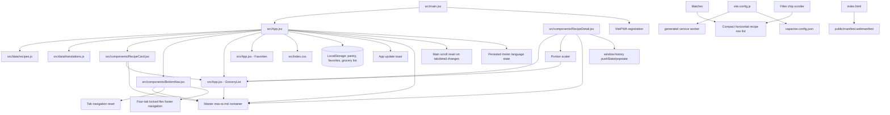

# MASAK APA HARI INI Code Graph

## Runtime Flow

The recipe catalog contains 53 unique recipes, including 12 Ayam, Daging & Kambing recipes, 12 Seafood & Fish recipes, and a 12-dish Express Noodles & Rice batch added to the original 20. Three overlapping express dishes refresh existing stable IDs instead of creating duplicates.

1. `src/main.jsx` mounts `App` and registers the service worker.
2. `App` hydrates pantry selections, the staples toggle, and favorites from LocalStorage.
3. `Matcher` computes recipe matches, applies thresholds, then applies shared search/category filters.
4. `Discover` applies the same shared search/category predicate to the full recipe catalog.
5. `RecipeCard` displays recipes and toggles favorite IDs.
6. `RecipeDetail` displays a selected recipe and toggles its favorite ID.
7. `RecipeCard` and `RecipeDetail` send missing ingredients to `App.addMissing`.
8. `GroceryList` toggles, clears checked items, and clears the persisted grocery list.
9. `vite-plugin-pwa` precaches generated JS/CSS/HTML/assets and invokes the prompt update callback used by `App`.
10. `RecipeDetail` scales ingredient display and grocery quantities from `defaultServings` to the selected portion preset.
11. Matcher results render through a compact single-column horizontal row list; filter chips remain horizontally scrollable with edge padding.
12. Discovery shares the compact horizontal row list, while the locked `h-screen` flex shell keeps the four-tab navigation footer outside the scroll region.
13. `App` resets the main scroll container to the top when the active tab or selected recipe changes.
14. Recipe entry uses `pushState({ view: 'detail' })`; browser/Android back uses `popstate` to clear the selected recipe.
15. `App` owns the persisted `ms`/`en` language state; the shared translation dictionary and bilingual recipe fields flow through every view and navigation label.
16. The dedicated Favorites view omits Search controls and renders only recipes whose IDs are present in `favorites`; its empty state includes a Heart icon and an Explore Recipes/Cari Resipi action that navigates to Discover.
17. Discover and Matcher filter chips exclude Favorite/Kegemaran; the remaining four category chips use the padded horizontal scroller `flex overflow-x-auto flex-nowrap scrollbar-none px-4 pr-8 py-2 space-x-2 w-full items-center`.
18. The ingredient pool includes the expanded poultry/meat proteins, Rempah & Bahan Tumis, and Sos & Perasa categories used by the new recipes.
19. The ingredient pool also includes Siakap, Pari, Tilapia, Cencaru, Kembung, Sotong, Petai, seafood seasonings, and seafood garnishes for the seafood expansion.
20. The ingredient pool includes Karbo & Mi items, stir-fry vegetables, noodles/rice sauces, and express recipe complements for the expanded noodle and fried rice dishes.
21. The Express Noodles & Rice batch contains 12 requested dishes; Mee Goreng Mamak, Nasi Goreng Kampung, and Nasi Goreng Cina retain their stable IDs and refreshed ingredient sets, while nine additional dishes use new IDs.
22. Matcher ingredient selection is organized by horizontal category tabs with text search, a pantry-staples quick-select helper, a removable selected tray, and Clear All reset behavior.
